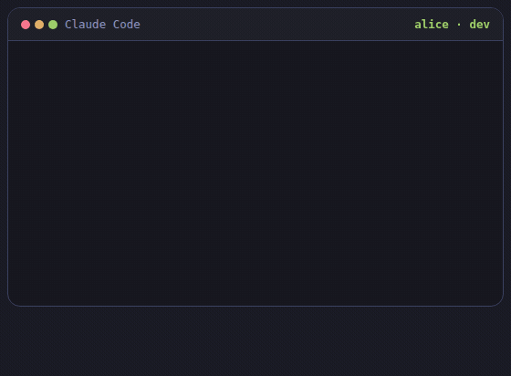

# kgai — shared memory for software teams building with AI

> **Your dev team already decided this. Nobody remembers why.**
> The *why* behind your code lives in people's heads and lost chat threads — and every AI
> coding session starts from zero. kgai is the missing shared memory: add it to your AI
> workflow once, and it **captures, syncs and recalls decisions by itself** while you work.

<p align="center">
  
</p>
<p align="center">
  <a href="https://kgai.dev">kgai.dev</a> · local-first — your code never leaves · opt-in team sync (git/S3) · zero upkeep · MIT
</p>

While you and your AI change code, kgai records the structural decisions into a small,
searchable knowledge graph — what changed, *why*, and what was rejected — **automatically,
without you asking**. Before touching an area, your AI checks what was already decided.
Nothing is ever overwritten, so you can always ask *how did this get this way?* and get
the full story.

- **Syncs like version control — without the merge conflicts.** Every decision is an
  immutable, content-addressed event; teammates (or their AIs) recording in parallel can
  never produce a textual conflict. Only real *semantic* conflicts surface — as branches
  you resolve with one new decision, and the resolution is kept too.
- **It even remembers the dead ends.** Rejected approaches stay in the graph with the
  reason they failed — so no engineer, and no AI, re-walks a path the team already proved
  wrong.
- **Measured, not promised.** 1,000,000 decisions, 30 concurrent writers: queries still
  answer in ~100 ms. Numbers at [kgai.dev](https://kgai.dev/#scale).

## See it in action

Alice ships product search. Her agent records the decision — by itself:

```
✓ recorded “Sold-out products stay visible in search”  d_1e67c079
    supersedes d_1f7c715a — kept in history
```

Weeks later, QA is testing and hits something odd: *“sold-out products show up in search —
bug?”* One question to the graph:

```
$ kg search "why are sold-out products visible in search"
● Sold-out products stay visible in search   decision
    Hiding sold-out items dropped organic landing traffic ~40%. Keep them visible as 'unavailable'.
    → product-search
```

And the whole evolution — the dead end included:

```
$ kg history "feature:product-search"
feature:product-search — 2 decision(s), oldest first

  2026-05-02  Search hides sold-out products              superseded
      why: Sold-out items clutter the results; hide them until restock.

  2026-07-16  Sold-out products stay visible in search    ● current
      why: Hiding sold-out items dropped organic landing traffic ~40%.
```

Not a bug — decided on purpose. Ticket closed in two minutes, no dev interrupted.

## Quick start

```bash
# install from GitHub (public marketplace lives in this repo)
claude plugin marketplace add kgaidev/kgai
claude plugin install kgai@kgai-marketplace
```

On first run the plugin sets itself up automatically (downloads a small prebuilt engine to
`~/.kgai`; falls back to building from source if needed). Then just work normally — Claude
reads and records decisions on its own. To record or query by hand:

```bash
/kgai:kg-ask "Invoice"        # what's decided about this area, and why
/kgai:kg-decision             # record a decision yourself
/kgai:kg-history              # how something evolved
```

## Initialize the graph for a project

The store is **per-project** and everything is picked up automatically — it is created in
`<project>/.kgai/store` on first use (and added to the project's `.gitignore`), and your
name on recorded decisions comes from `git config user.name`. To set it up explicitly up
front:

```bash
cd your-project
kg init
```

A brand-new graph is empty, so the first real value comes from **seeding it with what you
already know**. Two ways that work well:

1. **Let Claude interview the codebase (and you).** In a Claude Code session, ask something
   like: *"Walk through this codebase, identify the main domain elements (features,
   services, business objects) and how they relate, ask me about anything that looks like a
   deliberate decision, and record the results into the knowledge graph."* Claude maps the
   elements, asks you for the *why* behind non-obvious boundaries, and records everything
   via `kg ingest`.
2. **Import known past decisions by hand** — old ADRs, wiki pages, tribal knowledge. Write
   them as one `kg ingest` batch and give each decision its real `date` so the timeline is
   honest (see [Importing past decisions](#importing-past-decisions)).

Then check what the graph knows: `kg context` (whole picture), `/kgai:kg-ask "<area>"`.
From that point on, day-to-day capture is automatic.

## Importing past decisions

Seeding the graph with decisions that were really made earlier? Give each one a `date`
(`YYYY-MM-DD` or RFC3339) so the history and `kg as-of <date>` reflect the real timeline,
not the import time:

```json
{ "decision": { "title": "…", "date": "2025-03-15", "mutations": [ … ] } }
```

## What you can do

| You want to… | Command / slash |
|---|---|
| See what's decided about an area, and why | `/kgai:kg-ask` · `kg context --about X` / `--paths a,b` |
| Record a decision | `/kgai:kg-decision` · `kg ingest` |
| Review a task, graph-aware (read → review → capture) | `/kgai:kg-review` |
| See how something evolved | `/kgai:kg-history` · `kg history "feature:Invoice"` |
| See the whole picture at a past date | `kg as-of 2026-01-01` |
| Resolve conflicting decision branches | `/kgai:kg-conflicts` |
| Raw query (power users) | `/kgai:kg-query` · `kg query "…"` |

### Automatic capture — and no noise

Capture is hands-off, backed by two layers: the bundled **knowledge-graph skill** makes the
model record structural decisions on its own, and a **`Stop` hook** catches the case where
it edits code but forgets — nudging it to record before finishing. Trivial work (renames,
formatting, bug fixes) records **nothing**, so the graph stays signal, not noise.

In headless testing this held up across models: structural refactors auto-recorded reliably;
when the model was blocked from recording on its own, the hook still captured every time;
trivial edits recorded nothing even when nudged.

## Under the hood

The nodes are **domain elements** (features, services, business objects) joined by links; a
**decision** is an immutable event that reshapes that graph and carries who/why/when. The
chain of decisions is the history; the live graph is always the current shape.

It's event-sourced: an append-only, content-addressed **decision log** is the source of
truth, projected into an embedded **[LadybugDB](https://ladybugdb.com)/Kuzu** property graph
(queryable with Cypher) that can be rebuilt from the log at any time. Identity is a
deterministic hash of an element's kind+name, so recording the same thing twice converges
on one node with no coordination.

Full design: **[docs/ARCHITECTURE.md](docs/ARCHITECTURE.md)**.

## Configuration

| Env | Meaning | Default |
|---|---|---|
| `KGAI_STORE` | knowledge-graph store location | `<project>/.kgai/store` (per-project) |
| `KGAI_PROJECT` | project root used to locate the store | git top-level of the working dir |
| `KGAI_HOME` | engine binary + native lib home | `~/.kgai` |
| `KGAI_ACTOR` | your name on recorded decisions | git user / `$USER` |
| `KG_RELEASE_BASE` | prebuilt download base | this repo's latest release |

By default the KG is **per-project**: each project gets its own graph in
`<project>/.kgai/store` (auto-created on first use and added to the project's
`.gitignore`). The engine binary itself is shared in `~/.kgai`. Point `KGAI_STORE` at a
shared path if you want several projects to write into one graph.

## Team sync

Share one memory across the whole team — humans and AIs alike:

```bash
kg init --remote s3://your-bucket/team-kg    # or a git URL
kg sync                                      # push your decisions, pull everyone else's
```

- Works over a **git repo or S3 bucket you own** (any S3-compatible store). No server,
  no lock-in.
- Decisions are immutable, content-addressed events in per-writer append-only shards —
  parallel writers **cannot** produce a textual conflict, and every machine replays the
  shared log to a byte-identical graph.
- Genuinely contradictory decisions (the same element decided two ways) surface as a
  **branch** via `kg conflicts`; you resolve it by recording one decision that supersedes
  both — and the branch *and* its resolution stay in history.
- Copied stores are detected (identity is machine-bound) and fail loudly instead of
  silently forking history; `kg rotate` gives a copied store a fresh identity.
- Validated with 8-way concurrent syncs against production S3 and at 1,000,000-decision
  scale — numbers at [kgai.dev](https://kgai.dev/#scale).

## Roadmap

- **kgai cloud** — hosted sync plane, an interactive graph you can explore in the browser,
  and an MCP endpoint to plug the shared memory into any AI. Beta: [kgai.dev](https://kgai.dev/#cloud)
  or team@kgai.dev.
- macOS prebuilds (needs `@loader_path` linking + a DYLD-aware launcher).
- Optional decision signing for zero-trust team remotes.
- Contextual-search index for stores beyond ~100k decisions.

## License

MIT — see [LICENSE](LICENSE). Bundles the MIT-licensed Kuzu binding and `libkuzu`.
