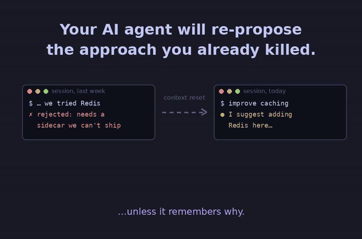

# kgai — shared decision memory for AI dev teams

> **Your dev team already decided this. Nobody remembers why.**
> The *why* behind your code lives in people's heads and lost chat threads — and every AI
> coding session starts from zero. kgai is the missing shared decision memory: add it to your AI
> workflow once, and it **captures and recalls decisions by itself** while you work.
> Team sync is opt-in (your own S3; git experimental).

<p align="center">
  
</p>
<p align="center">
  <a href="https://kgai.dev">kgai.dev</a> · local-first — your code never leaves · opt-in team sync (your own S3) · zero upkeep · MIT
</p>

While you and your AI change code, kgai records the structural decisions into a small,
searchable knowledge graph — what changed, *why*, and what was rejected — **automatically,
without you asking**. Before touching an area, your AI checks what was already decided.
Nothing is ever overwritten, so you can always ask *how did this get this way?* and get
the full story.

- **Syncs like version control — without the merge conflicts.** Every decision is an
  immutable, content-addressed event; teammates (or their AIs) recording in parallel can
  never produce a textual conflict. Only real *semantic* conflicts surface — as branches
  you resolve with one new decision, and the resolution is kept too.
- **It even remembers the dead ends.** Rejected approaches stay in the graph with the
  reason they failed — so no engineer, and no AI, re-walks a path the team already proved
  wrong.
- **Measured, not promised.** 1,000,000 decisions across 30 writers' shards: a decision
  lookup still answers in ~100 ms. Numbers at [kgai.dev](https://kgai.dev/#scale).

## See it in action

Alice ships product search. Her agent records the decision — by itself:

```
✓ recorded “Sold-out products stay visible in search”  d_1e67c079
    supersedes d_1f7c715a — kept in history
```

Weeks later, QA is testing and hits something odd: *“sold-out products show up in search —
bug?”* One question to the graph:

```
$ kg search "why are sold-out products visible in search"
● Sold-out products stay visible in search   decision
    Hiding sold-out items dropped organic landing traffic ~40%. Keep them visible as 'unavailable'.
    → product-search
```

And the whole evolution — the dead end included:

```
$ kg history "feature:product-search"
feature:product-search — 2 decision(s), oldest first

  2026-05-02  Search hides sold-out products              superseded
      why: Sold-out items clutter the results; hide them until restock.

  2026-07-16  Sold-out products stay visible in search    ● current
      why: Hiding sold-out items dropped organic landing traffic ~40%.
```

Not a bug — decided on purpose. Ticket closed in two minutes, no dev interrupted.

## Quick start

```bash
# install from GitHub (public marketplace lives in this repo)
claude plugin marketplace add kgaidev/kgai
claude plugin install kgai@kgai-marketplace
```

The plugin sets itself up the first time you start a Claude Code session with it enabled —
installing a plugin only downloads files, so nothing runs until then. Prebuilt engine
binaries ship for **Linux** (x86_64, aarch64) and **macOS** (Apple Silicon + Intel), so you
need neither Go nor a C compiler (the engine goes to `~/.kgai`; falls back to building from
source if needed). On **Windows**, run Claude Code inside WSL — there is no native engine,
and the installer says so rather than failing obscurely. Then just work normally — Claude
reads and records decisions on its own.
To record or query by hand:

```bash
/kgai:kg-ask "Invoice"        # what's decided about this area, and why
/kgai:kg-decision             # record a decision yourself
/kgai:kg-history              # how something evolved
```

The same setup also puts `kg` in `~/.local/bin`, so the CLI works in your own terminal and
not only inside Claude Code. If that directory isn't on the `PATH` your terminal builds —
which the installer confirms by asking your login shell, not just by grepping that shell's
profile — it appends one marked PATH line to the profile the shell actually reads. Open a
new terminal and `kg version` answers; if anything about that didn't work, the session's
status line says so instead of reporting success. Once the marked line is in place the
check is not repeated, so wiring that breaks *later* (say, a new `.bash_profile` that
shadows the `.profile` holding the line) goes unnoticed — delete the marked line and the
next session re-verifies from scratch.

### Install the CLI by hand

To get `kg` on a machine where the plugin never ran, or to repair an installation:

```bash
curl -fsSL https://raw.githubusercontent.com/kgaidev/kgai/main/scripts/install.sh | bash
```

That is the plugin's own installer, run standalone: same engine, same launcher, same
locations — see the [FAQ](#faq) for what it puts where and how to remove it. Once the
plugin runs too, both keep themselves current at every session start.

## Initialize the graph for a project

The store is **per-project** and everything is picked up automatically — it is created in
`<project>/.kgai/store` at session start (and by the first recorded decision, and added
to the project's `.gitignore`); your name on recorded decisions comes from
`git config user.name`. Read commands never create a store: where nothing has been
recorded they answer with an empty result and a note instead of minting a stray empty
graph. The one exception is a repo shipping a committed `.kgairc` you have not yet decided
on: while that approval is pending the local store is **not** created either, so approving
its team store later does not leave a stray one behind (see
[docs/CONFIGURATION.md](docs/CONFIGURATION.md)). To set it up explicitly up front:

```bash
cd your-project
kg init
```

A brand-new graph is empty, so the first real value comes from **seeding it with what you
already know**. Two ways that work well:

1. **Let Claude interview the codebase (and you).** In a Claude Code session, ask something
   like: *"Walk through this codebase, identify the main domain elements (features,
   services, business objects) and how they relate, ask me about anything that looks like a
   deliberate decision, and record the results into the knowledge graph."* Claude maps the
   elements, asks you for the *why* behind non-obvious boundaries, and records everything
   via `kg ingest`.
2. **Import known past decisions by hand** — old ADRs, wiki pages, tribal knowledge. Write
   them as one `kg ingest` batch and give each decision its real `date` so the timeline is
   honest (see [Importing past decisions](#importing-past-decisions)).

Then check what the graph knows: `kg context` (whole picture), `/kgai:kg-ask "<area>"`.
From that point on, day-to-day capture is automatic.

## Importing past decisions

Seeding the graph with decisions that were really made earlier? Give each one a `date`
(`YYYY-MM-DD` or RFC3339) so the history and `kg as-of <date>` reflect the real timeline,
not the import time:

```json
{ "decision": { "title": "…", "date": "2025-03-15", "mutations": [ … ] } }
```

## What you can do

| You want to… | Command / slash |
|---|---|
| See what's decided about an area, and why | `/kgai:kg-ask` · `kg context --about X` / `--paths a,b` |
| Record a decision | `/kgai:kg-decision` · `kg ingest` |
| Review a task, graph-aware (read → review → capture) | `/kgai:kg-review` |
| See how something evolved | `/kgai:kg-history` · `kg history "feature:Invoice"` |
| See the whole picture at a past date | `kg as-of 2026-01-01` |
| Resolve conflicting decision branches | `/kgai:kg-conflicts` |
| Raw query (power users) | `/kgai:kg-query` · `kg query "…"` |

### Automatic capture — and no noise

Capture is hands-off, backed by two layers: the bundled **knowledge-graph skill** makes the
model record structural decisions on its own, and a **`Stop` hook** catches the case where
it edits code but forgets — nudging it to record before finishing. Trivial work (renames,
formatting, bug fixes) records **nothing**, so the graph stays signal, not noise.

In headless testing this held up across models: structural refactors auto-recorded reliably;
when the model was blocked from recording on its own, the hook still captured every time;
trivial edits recorded nothing even when nudged.

## Under the hood

The nodes are **domain elements** (features, services, business objects) joined by links; a
**decision** is an immutable event that reshapes that graph and carries who/why/when. The
chain of decisions is the history; the live graph is always the current shape.

It's event-sourced: an append-only, content-addressed **decision log** is the source of
truth, projected into an embedded **[LadybugDB](https://ladybugdb.com)/Kuzu** property graph
(queryable with Cypher) that can be rebuilt from the log at any time. Identity is a
deterministic hash of an element's kind+name, so recording the same thing twice converges
on one node with no coordination.

Full design: **[docs/ARCHITECTURE.md](docs/ARCHITECTURE.md)**.

## Configuration

Settings resolve in three layers, most specific first — the same shape in every file,
the way `git config` and npm do it:

| Layer | File | Who it is for |
|---|---|---|
| **session** | `<store>/kg.config.json` | this install; never committed (holds the cloud token) |
| **project** | `<repo>/.kgairc` | **committed** — the repo's default for everyone who clones it |
| **global** | `~/.kgai/config.json` | this machine; written only when you ask for it |

All three files hold the same JSON shape — only the location decides the layer, the way
npm layers `.npmrc`. Every key overrides — nothing merges — so `kg config` can always
name the one layer a value came from.

| Key | What it is | Where it may be set |
|---|---|---|
| `prompt` | your capture rules, given to the agent | any layer |
| `store` | where the decision log lives | project, global |
| `remote` | sync target | session, global |
| `cloud_url` | kgai cloud broker | session |

`remote` and `cloud_url` are deliberately **not** taken from the committed file. Syncing
belongs to the store, not to one repo (several repos can share one store, and one log
cannot push to two places), and `cloud_url` is the address your install-local token
authenticates against. Identity (`install_id`, `actor`, `machine`) and the token itself
do not layer at all.

```bash
kg config                                   # every layer, each effective value, its source
kg config set --project prompt "…"          # commit a capture rule for the whole repo
kg config set --global prompt -             # multi-line value from stdin
kg config unset prompt                      # clear it in this install; broader layers return
kg remote s3://team/kg                      # sync target for this store
```

**A committed `.kgairc` decides nothing until you approve it.** It is the one layer you
did not write — it arrives with `git clone`, from whoever made that repository — so kgai
ignores it until you say otherwise, and asks again whenever what it asks for changes (a
teammate's commit, a `git pull`).

You approve it **in the session**: Claude shows you the store path and the capture rules
the file asks for and waits for your answer — `/kgai:kg-trust` starts that on demand. It
never approves on its own initiative, whatever the file says. By hand it is:

```bash
kg trust --show    # what this repo's config asks for — approves nothing
kg trust           # approve it on this machine
kg trust --dismiss # don't want it: stop being prompted (keeps the local store)
kg trust --revoke  # withdraw an approval or a dismissal
```

Until then `kg config` reports it as `pending_approval` and the session says so instead
of loading the rules — nothing is blocked meanwhile, and the project's own local store is
not created until you decide (approve → the team store; keep working → it is made lazily
by your first recorded decision), so approving later does not leave a stray one behind.
Don't want the repo's config at all? `kg trust --dismiss` records that so you are not
asked again.
What you approve is what the file **asks for** — the values of `prompt` and `store` —
not its bytes: reformatting it asks nothing new, changing a rule asks again, and one
approval covers every repo asking for the same thing (a company standard is accepted once
per machine, and an inherited approval is announced once). Approvals live in
`~/.kgai/trusted.json`: per machine, per user, never synced. They cannot live in `.kgairc`
itself — that file is committed, so one person's approval would travel to everyone who
clones it, which is exactly what the step exists to prevent.

**[docs/CONFIGURATION.md](docs/CONFIGURATION.md)** is the full model: every key, which
layer may set it and why, what a committed config can and cannot cause, and the residual
risks.

**Project capture rules (`prompt`).** Whatever you put in this key is given to the agent
at the start of every session, in front of the knowledge-graph skill — the place for
conventions like *"elements are named after bounded contexts"* or *"every decision
carries the ticket ref"*. Commit it in `.kgairc` and the whole team's agents record the
same way; keep it in the global layer and it is just yours. The rules can only add to the
skill's rules, never relax them, and they reach the model framed as configuration data
inside a delimiter the file cannot forge — not as instructions from you. Anything past
8,000 bytes is truncated, because it is paid for at every session start.

| Env | Meaning | Default |
|---|---|---|
| `KGAI_STORE` | knowledge-graph store location (beats the `store` setting) | `<project>/.kgai/store` (per-project) |
| `KGAI_PROJECT` | project root used to locate the store | git top-level (worktrees → main worktree) |
| `KGAI_HOME` | engine binary + native lib home | `~/.kgai` |
| `KGAI_ACTOR` | your name on recorded decisions | git user / `$USER` |
| `KG_RELEASE_BASE` | prebuilt download base | this repo's latest release |

By default the KG is **per-project**: each project gets its own graph in
`<project>/.kgai/store` (auto-created on first use and added to the project's
`.gitignore`). The engine binary itself is shared in `~/.kgai`.

**Several repositories, one graph.** In a company the same people move between
`shop-api`, `billing` and `web`, and decisions cross those lines — *"payments moved out
of shop-api into billing"* is one decision about two repos. Enroll a repository into a
shared log once, commit it, and every clone follows without any per-developer setup:

```bash
kg config set --project store '${HOME}/kgai'   # this repo joins the shared graph
kg trust                                       # approve it here too — writing a .kgairc
                                               # does not approve it, not even for its author
git add .kgairc && git commit -m "kgai: record into the shared company graph"
# on every machine that clones it, once:
kg trust                                       # approve what the repo asks for
```

Approval is per machine and per configuration, so the author approves once as well. Skip
that second line and your own repo stays pending: every session says an approval is
waiting, and the `store` you just set does not apply — decisions keep going to the local
store until you accept the file.

`${HOME}`, `~` and repo-relative paths keep the committed value portable across
machines. Repos you never enroll keep their own log, so a side project never lands in
the company graph. `kg config` reports the resolved `store_root` and which layer decided
it — details, trade-offs and the migration path in
**[docs/SHARED-STORE.md](docs/SHARED-STORE.md)**.

**Branches and worktrees.** The graph is per *project*, not per branch. The store lives
outside your project's git (it has its own repo and sync cycle), so `git checkout` never
changes it: a decision recorded on a feature branch is visible from `main` immediately,
and decisions never cause merge conflicts in your code. `git worktree` follows the same
rule — every worktree of a project resolves to the main worktree's store, so switching to
a worktree does not hand you an empty graph. The configuration follows the store: the
`.kgairc` that governs is the one in the main worktree, so a branch cannot repoint its
worktree at a different graph; edits take effect once merged and checked out there. The
flip side is that a decision recorded on a branch you later abandon stays in the graph;
record a superseding decision to retract it.

## Team sync

Share one memory across the whole team — humans and AIs alike:

```bash
kg init --remote s3://your-bucket/team-kg    # or later: kg remote s3://your-bucket/team-kg
kg sync                                      # or /kgai:kg-sync from Claude Code
```

Instead of configuring every project, you can set one **global default** — used by any
project that has no remote of its own:

```bash
kg remote --global "s3://your-bucket/kg/{project}"   # {project} → the project dir's name
kg remote                                            # show every layer and the effective value
kg remote none                                       # opt THIS store out of the global default
kg remote --unset                                    # back to the global default
```

A store's own remote always wins over the global one — and a committed `.kgairc` cannot
set it at all, because syncing belongs to the store rather than to one repository (see
[docs/CONFIGURATION.md](docs/CONFIGURATION.md)). Without the `{project}` placeholder the
global value is used verbatim, meaning every project syncs into one shared graph — do
that only on purpose. `kg status` shows which remote is in effect and where it came from
(`remote_source: session | global | disabled`).

**Once a remote is configured, syncing is automatic.** A plugin hook fires `kg sync
--auto` in the background at session start and after every turn — detached, so nobody
ever waits on the network. It throttles itself (one attempt per minute), skips without
blocking when another write holds the store, and with no remote configured it exits in
a few milliseconds without doing anything. Decisions recorded during a session reach
the team within a turn; teammates' decisions arrive as you work. If the background
sync stops working (expired SSO, offline), it stays silent during work and tells
Claude once, at the next session start; `kg sync` shows the reason.

- The **S3 transport is the supported path** — any S3-compatible bucket you own. No
  server, no lock-in. It is exercised by the test suite (write-once races, copied-store
  fork detection) and by archived benchmark runs up to 1,000,000-decision stores.
- **Credentials** resolve the standard AWS way (env vars, shared config, IMDS). To pin a
  named profile — including an **SSO** profile — to *this* store instead of exporting a
  global `AWS_PROFILE`, add it to the remote URL:

  ```bash
  aws sso login --profile my-sso                                  # once, to refresh the SSO token
  kg init --remote "s3://your-bucket/team-kg?profile=my-sso&region=eu-west-1"
  ```

  `region` is optional (overrides the profile/env region). S3-compatible services
  (MinIO, R2, LocalStack) work via `AWS_ENDPOINT_URL`.
- **Git remotes are implemented but experimental** — not yet systematically tested.
- A hosted sync plane (**kgai cloud**) is in closed beta — [kgai.dev](https://kgai.dev/#cloud).
- Decisions are immutable, content-addressed events in per-writer append-only shards —
  parallel writers **cannot** produce a textual conflict, and every machine replays the
  shared log to the same graph (verifiable with `kg export --canonical`).
- Genuinely contradictory decisions (the same element decided two ways) surface as a
  **branch** via `kg conflicts`; you resolve it by recording one decision that supersedes
  both — and the branch *and* its resolution stay in history.
- Copied stores are detected (identity is machine-bound) and fail loudly instead of
  silently forking history; `kg rotate` gives a copied store a fresh identity.

## FAQ

**I installed the plugin, but `kg` isn't in my terminal.**
Installing a plugin only downloads its files — Claude Code runs no code at that moment,
and a plugin has no post-install hook. The engine and the `kg` launcher are set up by the
plugin's `SessionStart` hook, so they appear the first time you actually start a Claude
Code session with the plugin enabled. Start one session, open a new terminal, and `kg`
works from then on. To skip the wait — or to get the CLI on a machine that won't run
Claude Code at all — use the [by-hand install](#install-the-cli-by-hand).

If it's still missing after that, you're on **v1.4.0**, which decided whether
`~/.local/bin` was already on your `PATH` from evidence that couldn't answer it: its own
process environment (which carries that directory even when your terminal doesn't) and a
plain-text read of your shell profile, where a commented-out mention (uv, pipx and pip
all leave one behind) counted as "already handled" — as did an existing `kg` in that
directory, including the symlink an older by-hand install of *ours* leaves there. In
every case v1.4.0 skipped the PATH line and still reported `engine ready`, and it
reached the same wrong conclusion at every session start, so it never repaired itself.
Later versions ask a real shell instead, recognise their own leftovers, and warn instead
of claiming success — update the plugin (`claude plugin update kgai@kgai-marketplace`)
and start a session, and the line is written. To do it yourself, add this to the profile your terminal actually reads
(`~/.zshrc` for zsh, `~/.bash_profile` for bash on macOS, `~/.bashrc` for bash on Linux):

```bash
export PATH="$HOME/.local/bin:$PATH"
```

**The plugin updated, but my engine didn't.**
It does now: the installer compares a fingerprint that includes the plugin version, so a
plugin update reinstalls the engine at the next session start. Before v1.4.0 that
fingerprint was computed with a tool macOS doesn't ship, came out empty, and every Mac
kept whatever engine it first downloaded. Such an installation repairs itself once v1.4.0
runs; nothing to do by hand.

**Where does it all live, and how do I remove it?**
The engine and native lib in `~/.kgai` (override with `KGAI_HOME`), the `kg` launcher in
`~/.local/bin` (`KGAI_USER_BIN`), and each project's decision log in
`<project>/.kgai/store`. Removing it is `rm -rf ~/.kgai ~/.local/bin/kg` plus the one
`# added by kgai` line the installer adds to your shell profile when `~/.local/bin` isn't
already on `PATH`. Your projects' logs are separate — delete those per project.

## Roadmap

- **kgai cloud** — hosted sync plane, an interactive graph you can explore in the browser,
  and an MCP endpoint that plugs the shared decision memory into any MCP-capable agent
  (Cursor, Windsurf, Codex — not just Claude Code). Beta: [kgai.dev](https://kgai.dev/#cloud)
  or team@kgai.dev.
- Optional decision signing for zero-trust team remotes.
- Contextual-search index for stores beyond ~100k decisions.

## License

MIT — see [LICENSE](LICENSE). Bundles the MIT-licensed Kuzu binding and `libkuzu`.
