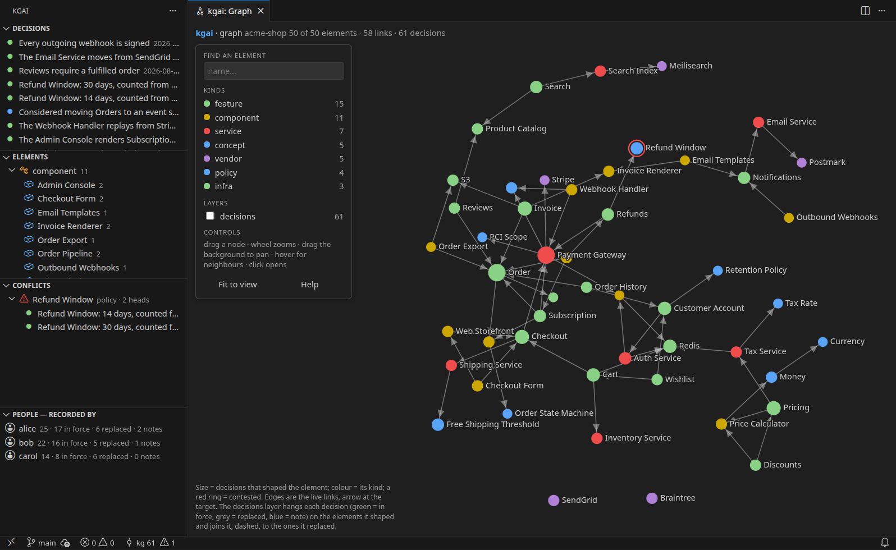
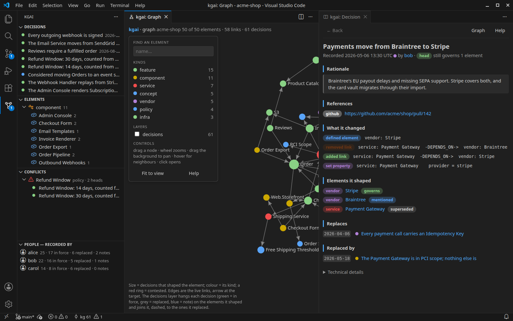
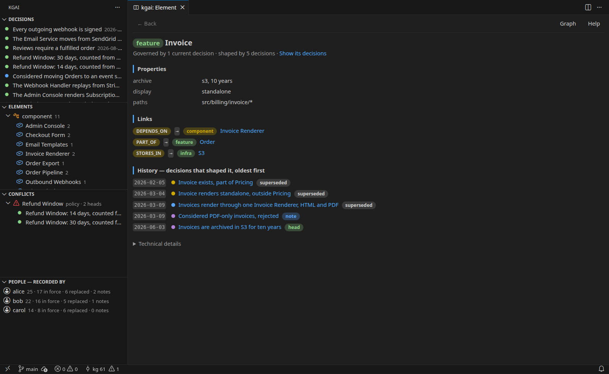
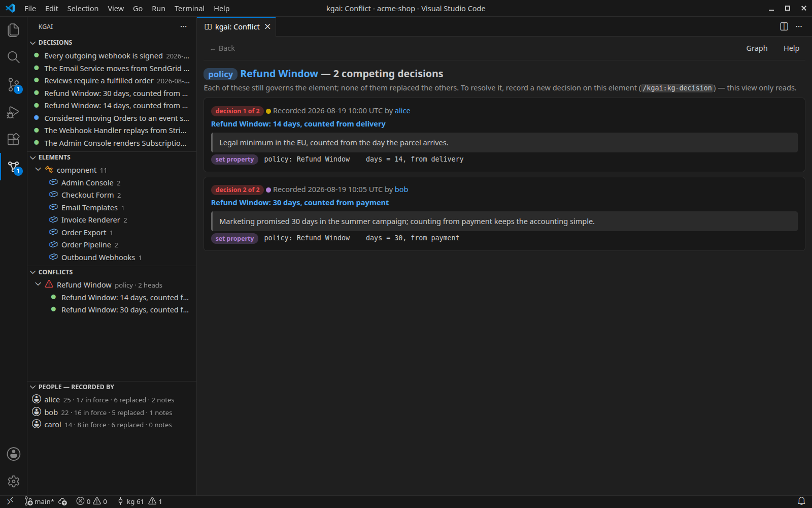
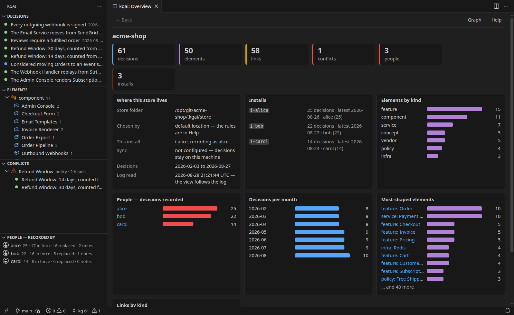
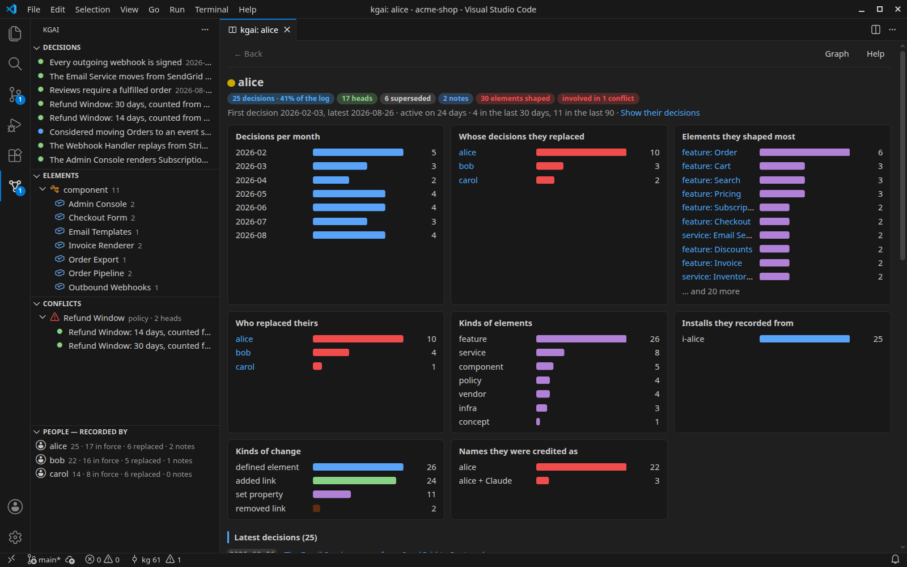
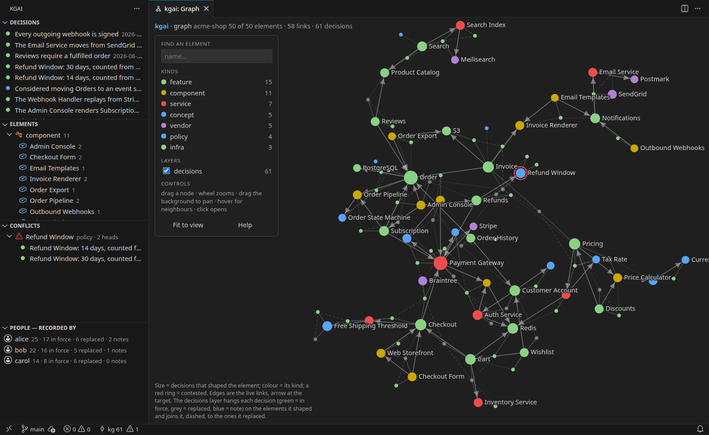
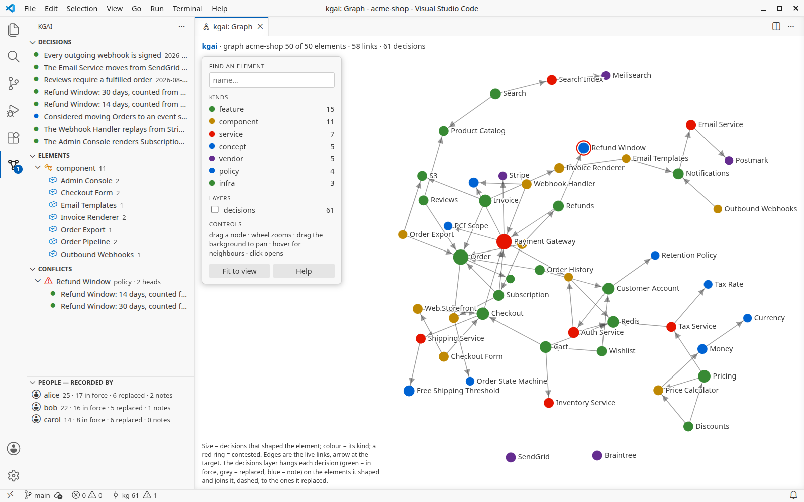

# kgai — the decisions of this project

The [kgai](https://kgai.dev) knowledge graph of the open project, in the sidebar:
every **decision** the team (and its AI assistants) recorded — with the rationale,
what it changed, and what replaced it — the **elements** those decisions are about,
the **contested** ones, and the **people** behind them. Read-only, no AI, one fixed
order, exact filters.

kgai itself records decisions through the `kg` CLI and the Claude Code plugin; this
extension shows what they recorded. It works in VS Code and in the editors built on
it (Cursor, Windsurf and others that install from Open VSX).

## What you get

- **Decisions** — newest first. Search the title and rationale as you type; narrow by
  state (*head* = still in force, *superseded* = replaced later, *note* = context only),
  who recorded it, who is credited, element kind, element name, install, dates.
- **Elements** grouped by kind, with how many decisions shaped each and which ones are
  contested. The element's page shows its properties, its links in both directions, and
  every decision that shaped it — the same order and head marks as `kg history`.
- **Conflicts** — elements governed by two or more decisions at once, the competing
  decisions side by side.
- **People** — how many of each person's decisions still stand, whom they replaced and
  who replaced them, activity by month, their latest decisions. Counted by who recorded
  (the install's identity) or who is credited (the author field).
- **Overview** — counts, where the store lives and which rule chose it, charts.
- **Graph** — the live graph on a canvas: elements coloured by kind and sized by the
  decisions that shaped them, links as arrows, contested elements ringed in red, and the
  decisions themselves as a layer you can switch on (hanging on the elements they shaped,
  dashed to the ones they replaced). Search, hide kinds, drag, zoom; hover shows the
  neighbours; a click opens the node in the detail panel. It follows the log like
  everything else.
- A status bar item with the number of decisions and conflicts; the view follows the
  log, so a decision recorded by `kg`, a sync or a rebuild shows up within two seconds.

Every page explains its words in place, and **kgai: Help** defines all of them.

## In pictures

Click a node in the graph and the decision opens beside it — the rationale, what it
changed, what it replaced and what replaced it:

An element: its properties, its links in both directions, and every decision that
shaped it — with the head marks `kg history` gives:

A contested element — two decisions govern it at once, side by side:

The overview — counts, where the store lives and which rule chose it, installs, charts:

A person — how much of their work still stands, whose decisions they replaced and who
replaced theirs, what they shaped, the names they were credited as:

The decisions as a layer over the graph — each hangs on the elements it shaped, dashed
to the ones it replaced:

The pictures show **acme-shop**, a fictional shop's checkout and billing as three people
shaped it over seven months — 61 decisions, one still contested. It lives in
[`examples/acme-shop`](https://github.com/kgaidev/kgai/tree/main/examples/acme-shop) of the
kgai repository; copy it out as a folder of its own (or clone it) and open it.

The pages take the editor's colours, light themes included:

Every picture above has a light-theme twin in
[`media/screenshots/light`](https://github.com/kgaidev/kgai/tree/main/editors/vscode/media/screenshots/light).

## Which store is shown

The one `kg` would use in the workspace folder (or the folder in the `kgai.projectFolder`
setting): `KGAI_STORE`, then the project's approved `.kgairc`, then `~/.kgai/config.json`,
then `<project>/.kgai/store`. A committed `.kgairc` that is still waiting for approval is
reported and decides nothing — approve it with `kg trust`; this extension never approves
anything.

## What it promises

The extension ships its own small reader, `kgread`, which only reads the log files. It
never opens the graph database (which allows one writer or many readers, so an open
reader could block `kg`), never takes the store's lock, never writes, never syncs, never
calls the network, and ranks nothing. Nothing else needs to be installed.

## Settings

| setting | meaning |
|---|---|
| `kgai.projectFolder` | the folder the store is resolved from, as `kg` would resolve it there (default: the first workspace folder) |
| `kgai.readerPath` | a `kgread` binary to use instead of the bundled one |

## Commands

`kgai: Search Decisions`, `kgai: Filter Decisions`, `kgai: Clear Filters`,
`kgai: Search Elements`, `kgai: Count People By…`, `kgai: Overview`, `kgai: Refresh`,
`kgai: Open Project Folder…`, `kgai: Help`. In the detail panel, `Alt+Left` goes back.
